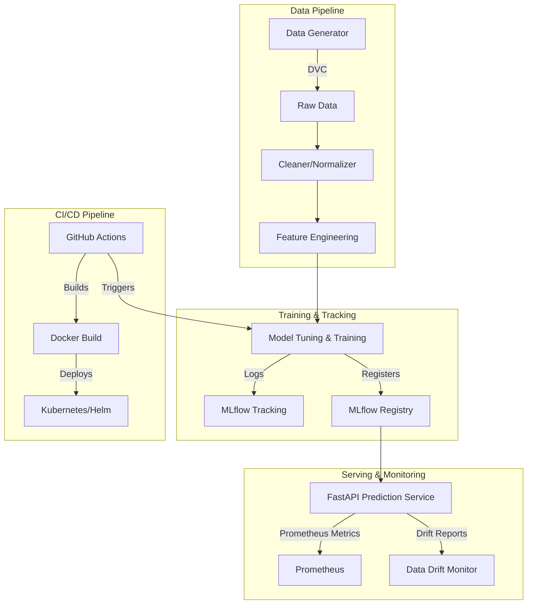

# 🔥 PyroShield AI — Wildfire Containment & Resource Deployment

> **MLOps & RL Project:** An intelligent agent decides where to deploy firefighting resources on a grid-based wildfire simulator to minimise burned area, wrapped in a full production-ready MLOps platform.


## 🌍 SDG Alignment
| SDG | Connection |
|-----|-----------|
| **SDG 13 — Climate Action** | Reducing wildfire damage lowers CO₂ emissions and combats climate change |
| **SDG 15 — Life on Land** | Preserving forest ecosystems protects terrestrial biodiversity |

---

## 🏗️ System Architecture

Our MLOps architecture consists of four main components: Data Pipeline, Model Training & Tracking, CI/CD, and Serving.



---

## 🚀 Quick Start

### 1. Local Setup
```bash
git clone <repo-url>
cd Wildfire-Containment-Resource-Deployment
pip install -r requirements.txt
```

### 2. DVC Data Pipeline
```bash
# Generate, clean data, and run model training stages
dvc repro
```

### 3. Training & MLflow Tracking
```bash
# Start MLflow UI
mlflow ui &

# Train a model (tracked automatically)
python src/tracking.py --config configs/qlearning_v1.yaml --algorithm qlearning
```

### 4. Start the Prediction API
```bash
# Using Docker Compose (API + MLflow + Prometheus)
docker-compose up -d

# Or locally
python -m api.app
```
*API available at `http://localhost:8000/docs`*

---

## 🤖 Models Supported

We have expanded the RL algorithms from a simple tabular agent to multiple options:
1. **Q-Learning** (Tabular, Off-Policy) - Good baseline.
2. **SARSA** (Tabular, On-Policy) - Safer, conservative deployment strategy.
3. **Double Q-Learning** (Tabular) - Reduces maximization bias for robust value estimation.
4. **DQN** (Neural Network, Replay Buffer) - Scales to complex, high-dimensional state spaces.

---

## 🔬 Experiment Tracking (MLflow & DVC)

- **Data Versioning:** Handled by DVC (`.dvc/config`, `dvc.yaml`).
- **Experiment Tracking:** MLflow logs parameters, metrics (Reward, Burned Cells, Convergence), and models.
- **Model Registry:** Best policies are registered and pulled automatically by the API container.

---

## ☸️ Production Deployment

The project is packaged for Kubernetes using Helm.
```bash
# Deploy to K8s cluster
helm upgrade --install pyroshield ./helm/pyroshield --namespace pyroshield --create-namespace
```

---

## 📋 Git Branches & Collaboration
- `main`: Production-ready code.
- `dev`: Integration branch where CI/CD runs.
- `feature/*`: For new work. PRs require reviews (see `CODEOWNERS`).

See [CONTRIBUTING.md](CONTRIBUTING.md) for more details.
